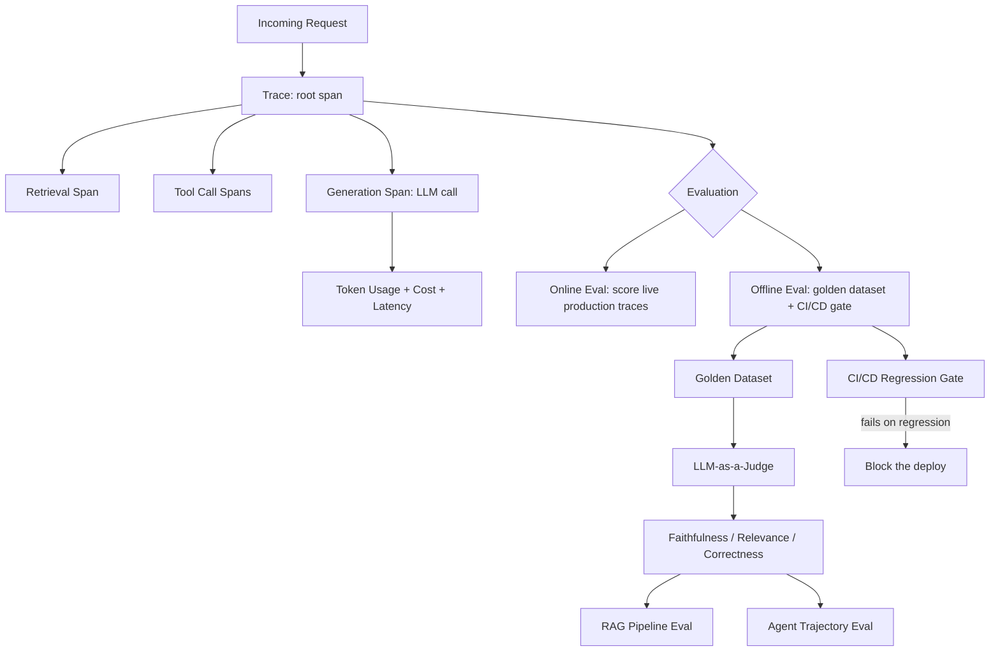
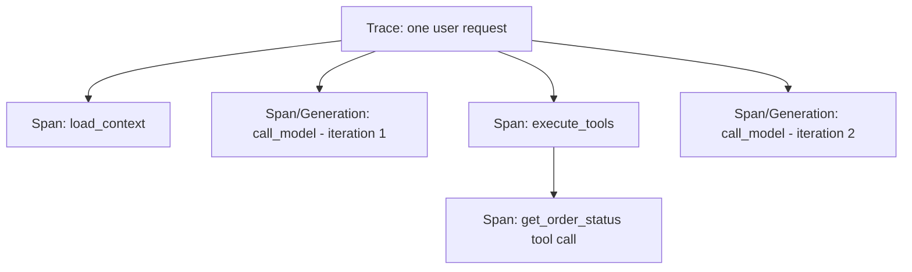
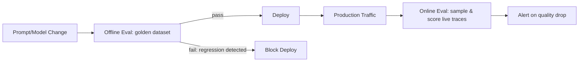
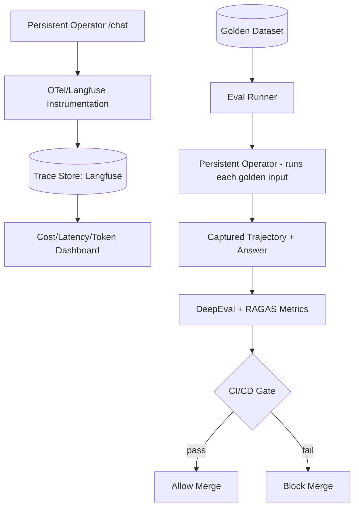

# Week 5 — Evals & Observability

## Week Objective

By the end of this week, you should be able to: instrument an AI application with end-to-end tracing that captures every LLM call, tool execution, and retrieval step; track token usage, latency, and cost per request as first-class telemetry; build and use a golden dataset; implement LLM-as-a-Judge scoring correctly (including its known failure modes); evaluate the three pillars of RAG quality (faithfulness, relevance, correctness) and the distinct problem of evaluating agent tool-call trajectories; and wire evaluation into a CI/CD regression gate so a quality regression fails a build the same way a broken unit test would.

## Learning Map



The throughline: **tracing captures what actually happened** (the raw material), and **evaluation judges whether what happened was good** — offline (before deploy, against a golden dataset, gating CI/CD) or online (continuously, against live traffic). Everything this week is in service of replacing "it felt fine when I tried it" with numbers you can gate a deploy on.

---

# 1. Why "Vibes" Don't Scale

## What Problem Does This Week Solve?

Traditional software testing works because behavior is deterministic: the same input always produces the same output, so a unit test either passes or fails, forever, until the code changes. LLM-powered systems break this assumption at every level — the same prompt can produce different wording on different calls, a "better" model or prompt can silently regress on a subset of cases it used to handle correctly, and a RAG or agent system has multiple independent failure points (retrieval, tool selection, generation) that a simple pass/fail assertion on the final text can't localize.

## Mental Model

Think of traditional testing as checking whether a calculator gives the exact right number. Evaluating an LLM system is more like grading an essay: there's no single correct string, quality is graded along several dimensions (faithfulness to source material, relevance to the question, correctness of claims), graders can disagree, and you need a consistent rubric (a golden dataset + defined metrics) applied the same way every time so scores are comparable across model/prompt changes.

## The Three Pillars This Week Builds

1. **Tracing/Observability** — capturing exactly what happened in a request (inputs, outputs, intermediate steps, timing, cost) so failures are diagnosable, not mysterious.
2. **Evaluation** — scoring whether what happened was actually good, using consistent metrics and datasets rather than one engineer's subjective read.
3. **Regression gating** — wiring evaluation into CI/CD so a change that measurably degrades quality is caught automatically, the same discipline you already apply to code via unit tests.

## Common Mistakes

- Treating "it looks right in the demo" as sufficient validation before shipping a prompt or model change — this is precisely the "vibes" this week exists to replace.
- Adding tracing only after something breaks in production, rather than as a day-one requirement — by the time you need a trace to debug an incident, it's too late to add the instrumentation that would have captured it.

---

# 2. AI Tracing & Observability

## What Is It?

The practice of capturing a structured, hierarchical record of everything that happens during a single request to an AI system — every LLM call, every tool invocation, every retrieval step — with inputs, outputs, timing, and metadata attached to each step, organized into a **trace** (the whole request) made up of nested **spans** (individual steps within it).

## Why Does It Exist?

An agent or RAG request from Week 2-4 might involve a retrieval call, two tool calls, and three LLM calls before producing a final answer. If the final answer is wrong, "the LLM is wrong" tells you nothing actionable — you need to see exactly which step introduced the problem: did retrieval return irrelevant chunks? Did the model call the wrong tool? Did a tool return an unexpected result the model then reasoned incorrectly about? Tracing is what makes any of that inspectable after the fact, instead of only guessable.

## What Problem Does It Solve?

Without tracing, debugging a multi-step AI system means either adding ad hoc print statements (which you'll never remember to add everywhere, and which don't persist or aggregate across requests) or treating the whole system as an unobservable black box. Tracing gives you a permanent, queryable record of every request's full execution path — directly connecting back to week-4-notes.md's repeated point that ReAct-style traces and agent loops need to be inspectable, now with the actual infrastructure to make that inspection systematic rather than one-off.

## Mental Model

A trace is like a detailed **flight recorder** for one request: every instrument reading (each LLM call's input/output, every tool call's arguments/result, every retrieval's query/results), timestamped and nested to show exactly what called what, in what order, and how long each step took — so that after an "incident" (a bad or slow response), you can replay exactly what happened rather than reconstruct it from memory or logs scattered across your codebase.

## How It Works — The Trace/Span Hierarchy



- A **trace** represents one end-to-end unit of work (e.g., one `/chat` request).
- A **span** represents one step within it — can be a plain operation (a tool call, a retrieval) or a special **generation** span type specifically for LLM calls, which additionally captures the prompt, completion, model name, and token usage.
- Spans **nest**: a span created while another is "active" automatically becomes its child, which is exactly how a multi-step agent loop's full Thought → Action → Observation trace (Week 4's ReAct pattern) becomes visible as one coherent tree instead of a flat, hard-to-follow log.

## 2a. Langfuse (Dedicated Deep Dive)

### What Is It?
An open-source LLM observability and evaluation platform purpose-built for exactly the trace/span model above, with first-class support for token usage, cost tracking, prompt management, and hooking evaluation scores directly onto traces.

### Why Langfuse Specifically (vs. generic logging)
Generic application logging tools weren't built with "an LLM call has a prompt, a completion, a model, and a token count that should all be queryable together" as a first-class concept. Langfuse's data model is shaped specifically around GenAI workloads: traces, spans, and a specialized **generation** observation type that natively understands prompts/completions/usage/cost.

### Important Current Detail — SDK v4 is OpenTelemetry-Native
As of writing, **Langfuse's Python SDK v4 is built directly on OpenTelemetry** rather than being a bespoke, Langfuse-only tracing API (this is a significant architectural change from the older v2 SDK many older tutorials still show — the legacy `@observe()` decorator from `langfuse.decorators` and manually-nested trace objects are superseded). This matters practically: because it's OTel-native, spans emitted by *any other* OpenTelemetry-instrumented library in your stack are automatically captured and correctly nested into your Langfuse traces with no extra glue code.

### How It Works — Practical Example
```python
from langfuse import get_client, observe

# get_client() reads LANGFUSE_PUBLIC_KEY / LANGFUSE_SECRET_KEY / LANGFUSE_HOST
# from the environment and returns a singleton client.
langfuse = get_client()

@observe(name="chat-request")
def handle_chat_request(user_query: str, user_id: str):
    # Enriches the currently-active span (the one this decorator created).
    langfuse.update_current_trace(user_id=user_id, tags=["production"])

    with langfuse.start_as_current_observation(
        as_type="generation",       # marks this span as an LLM call specifically
        name="answer-generation",
        model="anthropic/claude-sonnet-4.5",
        input=[{"role": "user", "content": user_query}],
    ) as generation:
        answer = call_llm(user_query)   # your actual LLM call
        generation.update(output=answer)  # usage/cost are often auto-captured
                                           # by provider integrations, or set explicitly

    return answer
```
Because `start_as_current_observation` updates the active OpenTelemetry context, any further span created inside that `with` block — including ones created deep inside a library you didn't write, as long as it's OTel-instrumented — is automatically nested underneath it. This is the direct mechanism behind "capturing tool execution and retrieval steps" from this week's stated learning goals: wrap your retrieval call and each tool execution in their own named spans, and the full agent trace (Week 4's loop, made visible) falls out naturally.

### Common Mistakes
- Following an older tutorial's `@observe()`-from-`langfuse.decorators` / manual trace-object pattern without realizing the SDK has moved to an OpenTelemetry-native model — check the current docs, since this is exactly the kind of fast-moving-framework risk flagged throughout this program.
- Not calling `langfuse.flush()` in short-lived processes (scripts, serverless functions, CI jobs) — spans are typically batched and sent asynchronously; a process that exits immediately after generating spans can lose them if they haven't been flushed.

### When Should I Use It?
Any AI application, from day one — tracing is cheap to add early and expensive to reconstruct retroactively after an incident.

## 2b. OpenTelemetry & the GenAI Semantic Conventions (Dedicated Deep Dive)

### What Is It?
OpenTelemetry (OTel) is the vendor-neutral, industry-standard framework for distributed tracing, metrics, and logs — not GenAI-specific. The **GenAI semantic conventions** are a specific, standardized set of attribute names (all under the `gen_ai.*` namespace) that OTel defines specifically for describing LLM operations, so telemetry is comparable across different tools and providers instead of every vendor inventing its own field names.

### Why It Exists
Without a shared standard, every observability vendor and every LLM SDK would use its own attribute names for the same concept (one library calls it `llm.model_name`, another `model`, another `gen_ai.request.model`) — making it impossible to build one dashboard or alert that works regardless of which tool produced the telemetry. The GenAI semantic conventions exist to fix exactly that, the same motivation as HTTP status codes or SQL being standards everyone can build against.

### Core Attributes (How It Works)
| Attribute | Meaning |
|---|---|
| `gen_ai.system` | The provider (e.g., `"anthropic"`, `"openai"`) |
| `gen_ai.request.model` | The model requested |
| `gen_ai.response.model` | The model that actually served the request (can differ from requested, e.g. after provider-side fallback) |
| `gen_ai.operation.name` | Type of operation: `"chat"`, `"embeddings"`, `"text_completion"` |
| `gen_ai.usage.input_tokens` / `gen_ai.usage.output_tokens` | Token counts — directly what Week 1's cost-tracking work needs |
| `gen_ai.request.temperature` / `gen_ai.request.max_tokens` | Request parameters |
| `gen_ai.tool.name` | Name of a tool called, for agent tracing (Week 4) |

### Important Trade-offs & Current Reality (as of writing)
- **The GenAI semantic conventions are still marked experimental/in development.** Core attributes (operation name, provider, model, token usage) have been stable in shape for a while and are safe to build on; the edges (multimodal content, agent-graph-specific attributes, MCP-specific conventions) are still actively changing.
- **Cross-SDK naming drift is real and currently unresolved**: different instrumentation libraries have historically emitted different attribute names for the same concept (e.g., `llm.token_count.prompt` vs. `gen_ai.usage.prompt_tokens` vs. the now-current `gen_ai.usage.input_tokens`) — a dashboard built against one naming convention can silently miss spans that use another. A normalization layer (a span processor that renames older/alternate attribute names to the current standard on export) is a common, practical mitigation.
- **Content capture is opt-in, by design, for privacy**: by default, only metadata (model, token counts, durations) is captured — full prompt/completion text, system prompts, and tool arguments are only attached to spans when content capture is explicitly enabled, since that content can contain sensitive user data. This is a deliberate privacy decision, not an oversight — decide who can access trace content and for how long before turning it on in production.

### Mental Model
OpenTelemetry is the postal system (how telemetry gets collected, batched, and delivered anywhere); the GenAI semantic conventions are the standard address format everyone agrees to write in, so any postal worker (observability backend) can read any package (span) regardless of who sent it.

### Common Mistakes
- Building a dashboard or alert against one specific attribute name without accounting for the fact that not every library in your stack emits the current, standardized name yet — verify what your actual instrumentation emits rather than assuming full standardization.
- Enabling full content capture in production without first deciding data-retention and access-control policy for what is now, effectively, a store of user conversations.

### Interview Questions
- Q: Why do the GenAI semantic conventions matter even though they're still "experimental"?
  A: They provide a shared vocabulary (the `gen_ai.*` namespace) so telemetry from different providers and instrumentation libraries can be queried, dashboarded, and alerted on consistently — the core attributes (model, tokens, operation type) have been stable for a while even while edge cases continue evolving.
- Q: Why is prompt/completion content capture opt-in rather than default-on?
  A: It can contain sensitive user data; capturing it by default would silently turn your trace store into an uncontrolled repository of user conversations without an explicit decision about access and retention.

## Key Connections (Tracing Section)
- Tracing is what makes Week 4's agent loop and ReAct-style trace **actually inspectable** in production, not just in a local debug print.
- OpenTelemetry's `gen_ai.*` attributes are the standardized vocabulary; Langfuse (and other observability backends) are tools that consume and visualize telemetry expressed in that vocabulary — understanding both the standard and a concrete implementation of it is the point.

## 🧠 Memory Anchor (Tracing)
A trace is a flight recorder for one request; spans are its nested instrument readings. `gen_ai.*` is the shared vocabulary everyone should eventually speak in — but check what your tools actually emit today.

---

# 3. Unit Economics: Token Usage, Latency, and Cost

## What Is It?

The practice of treating token usage, latency, and dollar cost as first-class, per-request telemetry — not an afterthought computed later from a monthly invoice, but data attached to every single trace as it happens.

## Why Does It Exist?

Recall Week 1: LLM calls are priced per token and take variable, sometimes substantial time. A system with no per-request cost/latency visibility can't answer basic operational questions: which endpoint is burning the most budget? Did yesterday's prompt change increase average cost per request? Is a specific customer's usage pattern unusually expensive? Unit economics tracking turns "we got a big bill at the end of the month" into "we can see, per request, exactly where the cost came from."

## What Problem Does It Solve?

Aggregate, account-level cost dashboards (what your LLM provider shows you) tell you total spend, not which feature, which prompt, or which user is driving it. Attaching cost/token/latency to individual traces means you can slice by any dimension your trace metadata captures — by endpoint, by customer, by model tier (Week 1's tiering decisions become measurable rather than assumed), by whether a request went through Week 3's expensive full hybrid+rerank pipeline vs. cheap semantic-only path.

## Mental Model

Think of this the way you'd think about a cloud bill broken down by service and endpoint rather than one lump sum — unit economics is "cost accounting," applied per AI request instead of per infrastructure resource.

## How It Works — What to Capture Per Request

| Metric | Where It Comes From | Why It Matters |
|---|---|---|
| Input tokens | `gen_ai.usage.input_tokens` (or provider response `usage` field, as in Week 1's `UsageInfo`) | Direct cost driver; also a proxy for context bloat (Week 1's attention-cost discussion) |
| Output tokens | `gen_ai.usage.output_tokens` | Usually priced higher than input; directly tied to response length |
| Cost (USD) | Computed from tokens × the model's per-token pricing (Week 1's `CostCalculator`) | The actual dollar signal stakeholders care about |
| Time-to-first-token | Time from request start to the first streamed token | User-perceived responsiveness (Week 1's streaming discussion) |
| Total latency | Full request duration | Operational SLA tracking |
| Latency breakdown per span | How much of total latency was retrieval vs. tool calls vs. generation | Localizes *where* slowness comes from — directly actionable, unlike a single aggregate number |

## Practical Example — Latency Breakdown Reveals the Real Bottleneck
A request that takes 8 seconds total might break down as: 0.1s retrieval, 6.5s across three sequential tool calls, 1.4s final generation. Without per-span latency (i.e., without tracing), you'd only see "8 seconds, slow" — with it, the actionable finding is obvious: the tool calls are the bottleneck, not the model.

## Important Trade-offs
- Capturing this data has a small but real overhead (extra attributes per span, aggregation queries) — negligible compared to LLM call latency itself, but worth being aware of at very high request volumes.
- Cost attribution across a multi-step agent loop (Week 4) needs to sum cost across every LLM call in the loop, not just the final one — an agent that took 5 iterations to answer cost 5 calls' worth, and your dashboard needs to reflect that, not just the last call.

## Common Mistakes
- Only tracking cost at the account/monthly level, discovering a regression weeks after it started rather than the day it shipped.
- Computing "average latency" across fundamentally different request types (a simple semantic-only RAG query and a full multi-tool agent loop) and drawing conclusions from a number that's an apples-to-oranges blend of very different workloads — segment by request type/route before aggregating.

## Interview Questions
- Q: Why attach cost and token usage to individual traces instead of relying on the provider's monthly billing dashboard?
  A: Per-trace data lets you slice cost by any dimension you capture (endpoint, customer, model tier, retrieval strategy) and catch a regression the day it ships, rather than discovering an aggregate spike weeks later with no way to attribute it to a specific change.

## 🧠 Memory Anchor
Unit economics = per-request cost accounting, not a monthly invoice. Latency *breakdown* by span is what makes a slow request actionable instead of just "slow."

---

# 4. LLM Evaluation Fundamentals

## What Is It?

The discipline of scoring an LLM system's outputs against defined quality criteria, in a repeatable, comparable way — as opposed to informally reading a handful of outputs and forming an impression.

## Why Does It Exist? / What Problem Does It Solve?

Section 1 already covered the core motivation: LLM outputs are non-deterministic and quality is multi-dimensional, so a simple string-equality assertion (`assert output == expected`) is both too strict (rejects a correct answer phrased differently) and too permissive (a wrong answer can accidentally match superficial string checks). Evaluation frameworks exist to define *what* "good" means along specific, measurable dimensions, and *how* to score it consistently.

## Mental Model

Evaluating an LLM output is grading an exam answer against a rubric, not checking it against a single "correct" string — you need: (1) the rubric itself (what dimensions matter — faithfulness? relevance? correctness?), (2) a grader (a human, a deterministic check, or another LLM acting as judge), and (3) a consistent way of applying both across every example so scores are comparable over time and across changes.

## How It Works — Where Evaluation Fits in the Lifecycle



Two distinct evaluation modes, both necessary:
- **Offline evaluation**: run against a fixed, known golden dataset (section 5) *before* shipping a change — this is what powers a CI/CD regression gate.
- **Online evaluation**: continuously score a sample of real, live production traffic — this catches issues offline evals can't (real user query distribution shifting, edge cases the golden dataset didn't anticipate).

## Important Trade-offs
| | Offline Eval | Online Eval |
|---|---|---|
| When it runs | Pre-deploy, in CI/CD | Continuously, on live traffic |
| What it catches | Known regressions against known cases | Unknown/emerging issues, real query distribution |
| Cost | Bounded (fixed dataset size) | Ongoing (scales with traffic, if scoring every request) |
| Feedback speed | Immediate, blocks a bad deploy | Delayed — issue is already in production when caught |

## Common Mistakes
- Relying exclusively on offline evaluation against a static golden dataset — it cannot catch a shift in real-world query patterns that the dataset never anticipated.
- Relying exclusively on online evaluation — issues are only caught *after* they've already reached real users, with no pre-deploy gate to prevent them in the first place.

## When Should I Use Which?
Use both — offline evaluation as a deploy gate (this week's build), online evaluation as an ongoing production quality signal (a natural extension once the offline harness exists).

## 🧠 Memory Anchor
Evaluation is grading against a rubric, not checking against one correct string. Offline gates deploys; online watches production. You need both.

---

# 5. Golden Datasets

## What Is It?

A curated, fixed set of representative input/expected-output examples (and, for RAG, the expected relevant context) used as the stable benchmark that every evaluation run is measured against — the "golden" name signals that these examples are trusted, deliberately chosen, and don't change on a whim.

## Why Does It Exist?

Without a fixed dataset, "did quality improve or regress?" has no stable baseline to compare against — you'd be comparing today's informal spot-checks against yesterday's different informal spot-checks. A golden dataset is what makes evaluation runs comparable over time: the exact same inputs are scored before and after a change, so any score difference is attributable to the change, not to different test cases being used.

## Mental Model

A golden dataset is a **regression test suite**, but for quality dimensions instead of binary pass/fail assertions — the same reason a codebase keeps a stable test suite instead of writing new, different tests every time you want to check nothing broke.

## How It Works — What Goes Into a Golden Example

| Field | Purpose |
|---|---|
| Input | The realistic user query/request |
| Expected output (or reference answer) | What a correct response looks like — used by correctness-style metrics |
| Expected/reference context (for RAG) | Which chunks *should* be retrieved — used to score retrieval quality independent of generation quality |
| Metadata/tags | Category of the example (e.g., "edge case," "common query," "known-hard case") — lets you slice eval results by category, not just an overall average |

## Building a Golden Dataset — Practical Sources
- **Real production queries** (sampled and curated, with PII handled appropriately) — the most representative of actual usage.
- **Deliberately constructed edge cases** — known-hard queries, ambiguous phrasing, adversarial inputs.
- **Synthetically generated examples** — an LLM can generate plausible query variations from source documents (several tools, including DeepEval's Synthesizer, support this) to bootstrap dataset size before enough real traffic exists.
- **Regressions from past incidents** — every real bug found in production is a candidate golden example, so it never silently regresses again — the direct AI-system analog of "write a test that reproduces the bug before fixing it."

## Important Trade-offs
- Too small a dataset → statistically noisy scores, easy to overfit a prompt change to the specific examples in it.
- Too large/unmaintained a dataset → slow, expensive eval runs, and stale examples that no longer reflect real usage patterns.
- Static datasets can go stale as your product and user base evolve — periodic review and refresh is necessary, not optional.

## Common Mistakes
- Building the golden dataset entirely from "easy," obviously-correct examples — this gives false confidence, since it doesn't exercise the cases most likely to actually fail.
- Never revisiting the dataset after initial creation — production usage patterns shift, and a stale golden dataset increasingly measures the wrong thing.

## When Should I Use It?
Always, for any system going through iterative prompt/model changes — building the golden dataset is a prerequisite for offline evaluation (section 4) and CI/CD regression gating (section 10), not an optional nicety.

## 🧠 Memory Anchor
A golden dataset is a regression suite for quality, not correctness in the unit-test sense. Every past production bug is a candidate golden example.

---

# 6. LLM-as-a-Judge

## What Is It?

Using an LLM to score another LLM's (or system's) output against defined criteria, instead of (or alongside) human graders — e.g., asking a judge model "on a scale of 1-5, how relevant is this answer to this question?" and using that score as the metric.

## Why Does It Exist?

Human evaluation is the gold standard for judging nuanced quality dimensions like relevance and faithfulness, but it doesn't scale: you can't have a human read every output on every CI run, for every prompt change, forever. LLM-as-a-Judge exists to approximate human judgment at a speed and cost that makes continuous, automated evaluation actually practical.

## What Problem Does It Solve?
Simple automated metrics (exact match, keyword overlap, BLEU/ROUGE-style text-similarity scores) are poor proxies for the qualities that actually matter in LLM outputs — factual accuracy, relevance to intent, faithfulness to source material — because a correct answer can be phrased in countless ways that share little surface-level text similarity with a reference. An LLM judge can assess semantic and factual qualities directly, the way a human grader would, rather than relying on shallow text overlap.

## Mental Model
The judge model is a **grader following a rubric you write**, not an oracle with independent authority — the quality of LLM-as-a-Judge scoring depends entirely on how precisely you specify the grading criteria, the same way a human grader needs a clear rubric to grade consistently.

## How It Works — GEval as the Concrete Mechanism
DeepEval's `GEval` metric (a widely-used, research-backed implementation of this pattern) is a good concrete example of the mechanism:

```python
from deepeval.metrics import GEval
from deepeval.test_case import LLMTestCase, LLMTestCaseParams

correctness_metric = GEval(
    name="Correctness",
    criteria="Correctness - determine if the actual output is correct according to the expected output.",
    evaluation_params=[
        LLMTestCaseParams.ACTUAL_OUTPUT,
        LLMTestCaseParams.EXPECTED_OUTPUT,
    ],
    threshold=0.5,
)
```
Under the hood, a judge model is given the criteria, the relevant fields from the test case (here, the actual and expected outputs), and asked to produce a score (0-1) plus, critically, a **reason** explaining the score — the reason is what makes a judge score debuggable rather than an opaque number, letting you actually see *why* a case failed.

## Internal Mechanism — Known Failure Modes of LLM-as-a-Judge
This is the part worth understanding deeply, since these biases are well-documented and will bite you if unaddressed:

| Bias | What Happens |
|---|---|
| **Position bias** | When comparing two outputs (A/B), the judge can favor whichever is presented first (or second), regardless of actual quality — mitigated by randomizing/swapping presentation order across runs |
| **Verbosity bias** | Judges tend to rate longer answers as higher quality even when length adds no real value — a real, replicated finding across judge-model research |
| **Self-preference bias** | A judge model can rate outputs from its own model family more favorably — a reason to consider using a different model as judge than the one being evaluated, especially for high-stakes evaluation |
| **Inconsistency across runs** | The same input can receive slightly different scores across repeated judge calls, since the judge is itself a non-deterministic LLM call — mitigated by using a low/zero temperature for the judge and, for critical metrics, averaging across multiple judge calls |

## Practical Example — Why the "Reason" Field Matters
A metric that returns only `0.3` tells you a test failed; a metric that returns `0.3` with reason *"The actual output omits the refund deadline mentioned in the expected output"* tells you exactly what to fix. Always surface and log the judge's reasoning, not just the numeric score — this is the direct analog of Week 4's insistence on inspectable ReAct traces, applied to evaluation itself.

## Important Trade-offs
- LLM-as-a-Judge is cheaper and faster than human evaluation at scale, but is itself an LLM call — it costs money, has latency, and inherits general LLM unreliability (the biases above) that a purely deterministic metric wouldn't have.
- A stricter, more expensive judge model (or multiple judge calls averaged together) gives more reliable scores at higher cost — this is its own model-tiering-style trade-off (Week 1).

## Common Mistakes
- Writing vague judge criteria ("is this a good answer?") instead of specific, decomposed criteria — vague rubrics produce inconsistent, low-signal scores the same way a vague grading rubric produces inconsistent human grades.
- Using the exact same model as both the system being evaluated and the judge, for high-stakes evaluation, without accounting for self-preference bias.
- Trusting a single judge score without ever reading the accompanying reasoning — this discards the most actionable part of the output.

## When Should I Use It?
For quality dimensions that are semantic/contextual (relevance, faithfulness, tone, correctness against a nuanced reference) where simple string/overlap metrics are poor proxies — which is most of what actually matters in LLM output quality.

## When Should I NOT Use It?
For criteria that are actually deterministic and checkable in code (does the output contain valid JSON? does it stay under a length limit? does it avoid a specific banned word?) — using an expensive, non-deterministic LLM call to check something a regex or JSON parser can check exactly is unnecessary cost and adds a new source of unreliability for no benefit.

## Interview Questions
- Q: What is position bias in LLM-as-a-Judge, and how do you mitigate it?
  A: The judge tends to favor whichever output is presented first (or second) in a side-by-side comparison, independent of actual quality; mitigated by randomizing or swapping presentation order across evaluation runs.
- Q: Why should you always capture the judge's reasoning, not just its numeric score?
  A: The reasoning is what makes a failing score actionable — it tells you specifically what was wrong, the same way a numeric-only test failure with no message would be far less useful for debugging.

## 🧠 Memory Anchor
LLM-as-a-Judge is a grader following your rubric, not an oracle — and it has known, documented biases (position, verbosity, self-preference) you must actively account for.

---

# 7. Core Evaluation Metrics: Faithfulness, Relevance, Correctness

## What Is It?

Three distinct, commonly-conflated quality dimensions that need to be measured separately, because a response can score well on one while failing another entirely.

## Why They Must Be Measured Separately (What Problem This Solves)

A single overall "quality score" hides *which* dimension actually failed. An answer can be:
- **Faithful but irrelevant**: accurately reflects the retrieved context, but doesn't actually address what the user asked.
- **Relevant but unfaithful**: directly addresses the question, but states something not supported by (or contradicted by) the retrieved context — i.e., a hallucination.
- **Correct but poorly grounded**: happens to state a true fact, but not because the retrieved context supported it — meaning the *system* got lucky, which won't generalize.

Measuring all three separately is what lets you diagnose *which* part of the pipeline needs fixing.

## Definitions and Mental Models

| Metric | Definition | Mental Model |
|---|---|---|
| **Faithfulness** | Does the generated answer stay factually consistent with the provided/retrieved context — no claims that aren't supported by it? | "Did the answer only say things the source material actually backs up?" — this is specifically a hallucination-detection metric. |
| **Relevance** (Answer Relevancy) | Does the generated answer actually address the user's question/intent? | "Did the answer respond to what was actually asked?" — a technically true but off-topic answer scores low here even if perfectly faithful. |
| **Correctness** | Does the answer match the expected/reference answer (ground truth)? | "Is the answer actually right?" — this requires a reference/expected output, unlike faithfulness (which only needs the retrieved context) and relevancy (which only needs the question). |

## How It Works — Mechanism Sketch

**Faithfulness** (as implemented in RAGAS, section 8) works by: (1) breaking the generated answer down into individual factual claims, (2) checking each claim against the retrieved context to see if it's actually supported, and (3) scoring the proportion of claims that are supported. This claim-level decomposition is what makes faithfulness more rigorous than a single holistic "does this seem consistent?" judgment.

**Answer Relevancy** works by generating several plausible *questions* that the given answer would be a good response to, then measuring how semantically similar those generated questions are to the original question — if the answer is genuinely relevant, questions reverse-engineered from it should closely resemble what was actually asked.

**Correctness** compares the actual output against an expected/reference output — typically via a GEval-style LLM-as-a-Judge criterion (section 6) rather than exact string matching, precisely because a correct answer can be phrased many valid ways.

## Practical Example — Diagnosing With All Three Together
| Case | Faithfulness | Relevance | Correctness | Diagnosis |
|---|---|---|---|---|
| A | High | High | High | Working as intended |
| B | Low | High | Low | Model is hallucinating beyond what context supports — a **generation** problem |
| C | High | Low | Low | Model answered faithfully but off-topic — likely a **prompt/instruction-following** problem, not a retrieval problem |
| D | N/A (no relevant context existed) | Low | Low | Retrieval failed to find the needed information — a **retrieval** problem, not a generation problem |

This table is exactly why measuring all three (plus retrieval-specific metrics, section 8) matters: the *same* low overall quality score can point to entirely different root causes and entirely different fixes.

## Common Mistakes
- Reporting a single blended "quality score" that averages faithfulness, relevance, and correctness together — this discards the diagnostic value of knowing which dimension actually failed.
- Measuring correctness without a genuine reference/expected answer in the golden dataset — correctness fundamentally requires ground truth; faithfulness and relevancy do not.

## Interview Questions
- Q: Give an example where an answer could be faithful but score poorly overall.
  A: The answer accurately reflects the retrieved context (faithful) but doesn't actually address the user's question (low relevance) — e.g., answering a question about refund policy with accurate but unrelated shipping policy details from the context.
- Q: Why does correctness require a reference answer while faithfulness doesn't?
  A: Faithfulness only checks consistency between the answer and the retrieved context that was actually used; correctness checks the answer against an external ground truth, which requires that ground truth to exist in the dataset.

## 🧠 Memory Anchor
Faithful = matches the context. Relevant = matches the question. Correct = matches the ground truth. Score all three separately — a single blended score hides which one broke.

---

# 8. RAG Pipeline Evaluation

## What Is It?

Evaluating a RAG system (Weeks 2-3) end to end by scoring both halves separately — **retrieval quality** (did we find the right chunks?) and **generation quality** (did we produce a good answer from them?) — rather than only judging the final answer.

## Why Evaluate the Two Halves Separately

A RAG system can fail at retrieval (missing the relevant chunk entirely) or at generation (retrieving the right chunk but the model still answering poorly) — these are different bugs requiring different fixes (tune chunking/hybrid search vs. tune the prompt/model), and a final-answer-only evaluation can't tell you which one occurred. This directly extends section 7's point: RAG evaluation needs retrieval-specific metrics *in addition to* faithfulness/relevance/correctness.

## 8a. RAGAS (Dedicated Deep Dive)

### What Is It?
RAGAS (Retrieval-Augmented Generation Assessment) is a dedicated, open-source evaluation framework purpose-built for RAG pipelines specifically — as opposed to general-purpose LLM eval frameworks, it ships with metrics designed around the retrieval + generation split above.

### Core RAGAS Metrics
| Metric | What It Measures | Needs Reference Answer? |
|---|---|---|
| **Faithfulness** | Generated answer's factual consistency with retrieved context (section 7) | No |
| **Answer Relevancy** | How well the answer addresses the question (section 7) | No |
| **Context Precision** | Of the chunks retrieved, how many were actually relevant, and were the relevant ones ranked near the top? (directly evaluates Week 3's reranking/fusion quality) | Can use with or without a reference |
| **Context Recall** | Of all the relevant information that *exists* in the corpus, how much did retrieval actually find? | Yes, typically needs a reference answer/context to know what *should* have been retrieved |
| **Context Entity Recall** | A stricter recall variant checking specifically whether named entities present in the reference are present in retrieved context | Yes |

**Why Context Precision and Recall matter specifically for Week 3's work**: these are the metrics that directly answer "did the hybrid search + RRF fusion + reranking pipeline actually retrieve better than naive semantic search?" — turning that week's qualitative "seems better by inspection" into a measurable, comparable number.

### How It Works — Practical Example
```python
from datasets import Dataset
from ragas import evaluate
from ragas.metrics import faithfulness, answer_relevancy, context_precision, context_recall

eval_dataset = Dataset.from_dict({
    "question": [...],           # from your golden dataset
    "answer": [...],             # your system's generated answers
    "contexts": [...],           # the chunks your retriever actually returned
    "ground_truth": [...],       # reference answers, needed for context_recall
})

results = evaluate(
    eval_dataset,
    metrics=[faithfulness, answer_relevancy, context_precision, context_recall],
)
```
Each metric internally uses an LLM (and, for some metrics, an embedding model) to perform its scoring — RAGAS's metrics are themselves largely LLM-as-a-Judge implementations, specialized for the RAG evaluation problem (section 6's mechanism, applied here).

### Important Trade-offs
- Running the full RAGAS metric suite means multiple LLM calls per evaluated example (each metric may need its own judge call) — evaluation itself has real cost and latency, scaling with golden dataset size × number of metrics.
- Context Recall specifically requires a reference/ground-truth answer in your dataset — if your golden dataset only has questions and generated answers with no reference, this metric can't be computed.

### Common Mistakes
- Using only Faithfulness/Answer Relevancy and skipping Context Precision/Recall — this leaves the *retrieval* half of the pipeline effectively unmeasured, exactly the "final-answer-only" blind spot this section opened with.
- Not fixing the exact chunks passed into RAGAS's `contexts` field to what your retriever *actually* returned in production — evaluating against a "cleaner" hand-picked context set than what the real pipeline produces gives a falsely optimistic score.

### When Should I Use It?
Any RAG system (Weeks 2-3's projects) — RAGAS is specifically shaped for exactly this evaluation problem, rather than a general-purpose LLM eval library.

## Interview Questions
- Q: What's the difference between Context Precision and Context Recall?
  A: Context Precision asks whether the chunks that WERE retrieved are relevant (and well-ranked); Context Recall asks whether all the relevant information that EXISTS in the corpus was actually found — a system can have perfect precision (everything retrieved is relevant) while still having poor recall (it missed other relevant chunks entirely).
- Q: Why can't final-answer-only evaluation diagnose a RAG system's problems?
  A: It can't distinguish a retrieval failure (right information was never found) from a generation failure (right information was found but the model didn't use it well) — both look identical from the final answer alone.

## 🧠 Memory Anchor
RAGAS splits RAG evaluation into retrieval quality (precision/recall) and generation quality (faithfulness/relevancy) — measuring only the final answer can't tell you which half is actually broken.

---

# 9. Agent & Tool-Call Trajectory Evaluation

## What Is It?

Evaluating not just an agent's final answer, but the **sequence of steps** (the trajectory) it took to get there — which tools it called, in what order, with what arguments, and whether that path was actually correct/efficient — directly extending Week 4's agent loop and ReAct trace concepts into something scoreable.

## Why Does It Exist? / What Problem Does It Solve?

An agent can arrive at a correct final answer via a badly inefficient or even accidentally-correct path (e.g., calling an irrelevant tool, retrying the same failing action multiple times before stumbling onto the right one — precisely the stuck-loop pattern Week 4's safety valves guard against). Final-answer-only evaluation would score this a "pass," missing that the *process* was unreliable, expensive, or lucky rather than reliably correct — a real risk if the task shape shifts slightly next time.

## Mental Model

Grading a final answer only is like grading a math exam solely on the final numeric answer — grading the trajectory is grading the full worked solution, catching a case where the answer happens to be right despite using an invalid method (which won't generalize to the next problem).

## How It Works — What a Trajectory Evaluation Actually Checks

| Check | What It Verifies |
|---|---|
| **Tool selection correctness** | Did the agent call the *right* tools for this task (not missing a needed one, not calling irrelevant ones)? |
| **Argument correctness** | Were the arguments passed to each tool call actually correct given the context at that point? |
| **Sequencing/dependency correctness** | Were dependent tool calls made in the right order (Week 4's example: look up the order before refunding it)? |
| **Efficiency** | Did the agent take a reasonable number of steps, or did it loop, retry unnecessarily, or take a circuitous path? |
| **Safety-valve behavior** | Did the agent correctly stop when it should have (Week 4's max-iterations/repeated-call safety valves), rather than running to the limit unnecessarily or, conversely, giving up too early? |

## Practical Example — DeepEval's Trajectory/Agent Metrics
DeepEval's tracing integration captures the ordered sequence of an agent's tool calls and intermediate steps automatically, which is what enables trajectory-based metrics (like `TaskCompletenessMetric`) to evaluate the *full path*, not just the final string output:

```python
from deepeval.metrics import TaskCompletenessMetric
from deepeval.test_case import LLMTestCase
from deepeval import assert_test

def test_agent_task_completion(test_case: LLMTestCase):
    my_ai_agent(test_case.input)  # runs the agent; tracing captures the full trajectory
    assert_test(metrics=[TaskCompletenessMetric()])
```
Under the hood, a trajectory-aware metric is given the full recorded sequence of tool calls and reasoning steps (exactly the kind of `tool_call_log` you built in Week 4's Persistent Operator) and judges whether that sequence was a sound way to accomplish the task — not merely whether the final text answer sounds right.

## Important Trade-offs
- Trajectory evaluation requires your system to actually capture the full trajectory (tracing, section 2) — you cannot evaluate a path you never recorded. This is a direct dependency: agent evaluation is only as good as the tracing instrumentation underneath it.
- Judging trajectory correctness is inherently harder to specify precisely than judging a final answer — "was this a reasonable sequence of tool calls" is a more open-ended rubric than "does this answer match the reference," and inherits LLM-as-a-Judge's biases (section 6) more acutely.

## Common Mistakes
- Evaluating only the final answer of an agentic system and declaring it "working" without ever inspecting whether the path to get there was reliable, efficient, or safe — the exact blind spot this section exists to close.
- Building trajectory evaluation without first having reliable tracing (section 2) in place — there's no trajectory to evaluate if it was never captured.

## When Should I Use It?
Any agentic system (Week 4 onward) where *how* the answer was reached matters — which is most production agent use cases, since an unreliable or inefficient path today is a correctness or cost risk tomorrow even if it happened to work this time.

## Interview Questions
- Q: Why might an agent evaluation based only on the final answer miss a real problem?
  A: The agent could reach a correct answer via an inefficient, accidental, or unsafe path (wrong tool calls that happened not to matter, excessive retries, ignoring a safety valve) — final-answer-only scoring can't distinguish a reliably correct process from a lucky one.
- Q: What must be true of your system before trajectory evaluation is even possible?
  A: The full sequence of tool calls, arguments, and intermediate steps must actually be captured — i.e., proper tracing (section 2) is a prerequisite, not optional, for trajectory-based agent evaluation.

## 🧠 Memory Anchor
Grading only the final answer is grading only the exam's last line. Trajectory evaluation grades the full worked solution — and requires tracing to even exist.

---

# 10. DeepEval (Dedicated Deep Dive)

## What Is It?

An open-source LLM evaluation framework built specifically to feel like **pytest for LLM outputs** — evaluation logic is written as test functions, run via a CLI (`deepeval test run`), and designed from the ground up to slot into CI/CD the same way your existing unit test suite does.

## Why Does It Exist?

Bridging the gap between "we have an evaluation script we run manually sometimes" and "evaluation is a standard, automated gate in our deployment pipeline, exactly like unit tests" — DeepEval's whole design philosophy is making that bridge as short as possible for teams already comfortable with pytest.

## How It Works — Core Building Blocks

### LLMTestCase
The atomic unit of evaluation — bundles the input, your system's actual output, and (depending on the metric) an expected output and/or retrieval context:
```python
from deepeval.test_case import LLMTestCase

test_case = LLMTestCase(
    input="What if these shoes don't fit?",
    actual_output="You have 30 days to get a full refund at no extra cost.",
    expected_output="We offer a 30-day full refund at no extra costs.",
    retrieval_context=["All customers are eligible for a 30 day full refund at no extra costs."],
)
```

### Metrics
Pre-built metrics (`AnswerRelevancyMetric`, `HallucinationMetric`, `BiasMetric`, `ToxicityMetric`, and many more) plus `GEval` (section 6) for fully custom LLM-as-a-Judge criteria. Every metric produces a 0-1 score and a `threshold` determines pass/fail.

### assert_test — The pytest Bridge
```python
from deepeval import assert_test
from deepeval.metrics import AnswerRelevancyMetric

def test_relevancy():
    metric = AnswerRelevancyMetric(threshold=0.5)
    test_case = LLMTestCase(
        input="Can I return these shoes after 30 days?",
        actual_output="Unfortunately, returns are only accepted within 30 days of purchase.",
        retrieval_context=["Returns are only accepted within 30 days of purchase."],
    )
    assert_test(test_case, [metric])
```
This is a completely ordinary-looking pytest test function — `assert_test` raises an assertion failure if the metric's score falls below its threshold, so `pytest`'s (or `deepeval test run`'s) normal pass/fail reporting works unmodified.

### EvaluationDataset and Golden — Running a Whole Golden Dataset
```python
from deepeval.dataset import EvaluationDataset, Golden

dataset = EvaluationDataset(goldens=[Golden(input="...") , Golden(input="...")])
for golden in dataset.goldens:
    dataset.add_test_case(
        LLMTestCase(input=golden.input, actual_output=my_llm_app(golden.input))
    )
```
A `Golden` is essentially an unscored golden-dataset entry (section 5) — you run your actual system against each golden's input to produce a real `LLMTestCase`, which is then what gets scored. This is the concrete mechanism connecting "we have a golden dataset" to "we ran an evaluation against it."

### evals_iterator / Tracing Integration for Agents
For agentic systems (section 9), DeepEval's tracing integration captures the full execution trace (tool calls, intermediate reasoning) as your system runs against each golden input, which is what makes trajectory-based metrics like `TaskCompletenessMetric` possible — the dataset drives real executions, not just static input/output pairs.

## Important Trade-offs
- DeepEval's pytest-native design is a major strength for teams already using pytest-based CI, but means adopting some DeepEval-specific concepts (`LLMTestCase`, `Golden`, the metric classes) rather than being a drop-in for an existing, non-pytest eval pipeline.
- Metrics that use LLM-as-a-Judge internally (most of them) inherit that mechanism's cost, latency, and biases (section 6) — DeepEval doesn't eliminate those trade-offs, it packages them behind a clean, testable interface.

## Common Mistakes
- Hardcoding `LLMTestCase`s directly in test files for anything beyond a quick demo, instead of loading them from a maintained golden dataset (section 5) — this defeats the purpose of a stable, reusable regression suite.
- Setting metric thresholds without any empirical basis (just picking `0.5` because it's the default) — thresholds should be calibrated against what your system's real quality distribution looks like, the same way you wouldn't set a performance SLA without measuring real baseline latency first.

## When Should I Use It?
Any team wanting evaluation to behave like a first-class, CI/CD-integrated testing discipline rather than a manual, occasional script — which is precisely this week's stated goal of moving off "vibes."

## 🧠 Memory Anchor
DeepEval = pytest, but the assertions are LLM-as-a-Judge scores instead of equality checks. `assert_test` is the bridge that makes it a normal-looking, normally-reported test.

---

# 11. Regression Testing & CI/CD Gates

## What Is It?

Wiring evaluation (sections 4-10) directly into your CI/CD pipeline, so that a prompt, model, or retrieval-pipeline change that measurably degrades quality against the golden dataset **fails the build automatically** — exactly the same discipline as a broken unit test blocking a merge.

## Why Does It Exist? / What Problem Does It Solve?

Without this, evaluation is something a human remembers to run manually before a risky-feeling change — which means it gets skipped under time pressure, exactly when it matters most. A CI/CD gate makes evaluation mandatory and automatic, removing reliance on anyone remembering to check, the same argument that justifies unit tests running in CI rather than "trust the developer ran them locally."

## Mental Model

This is a **regression test suite for quality**, running in the same pipeline stage as your regular unit and integration tests — a prompt change that silently makes faithfulness worse should block a merge exactly the way a code change that breaks a unit test does.

## How It Works — Concrete CI/CD Wiring

```yaml
# .github/workflows/regression.yml
name: LLM Regression Test

on:
  push:
  pull_request:

jobs:
  test:
    runs-on: ubuntu-latest
    steps:
      - uses: actions/checkout@v4
      - name: Install dependencies
        run: pip install -r requirements.txt
      - name: Run evaluation regression suite
        run: deepeval test run tests/test_regression.py
        env:
          OPENAI_API_KEY: ${{ secrets.OPENAI_API_KEY }}
```
`deepeval test run` executes exactly like `pytest` — every `LLMTestCase`/metric combination that falls below its threshold is a failing test, and a failing test fails the GitHub Actions job, which (with standard branch protection rules) blocks the merge. This is the full loop closing: golden dataset (section 5) → metrics (sections 6-9) → `assert_test` (section 10) → CI/CD job → merge gate.

## Internal Mechanism — What Makes a Good Regression Gate

| Property | Why It Matters |
|---|---|
| **Deterministic-enough thresholds** | If judge-score noise (section 6) routinely flips a test from pass to fail with no real underlying change, the gate becomes untrustworthy and gets ignored — averaging multiple judge calls or using a slightly conservative threshold mitigates this. |
| **Fast enough to run on every PR** | A regression suite that takes an hour will get skipped or run only occasionally under deadline pressure — bound dataset size and metric count to keep CI runtime reasonable, mirroring how a slow unit-test suite gets neglected. |
| **Segmented, not just aggregate, reporting** | A gate that reports one overall pass/fail number hides *which* golden examples regressed — report per-category (section 5's metadata tags) so a regression is traceable to a specific capability, not just "something got worse." |

## Practical Example — What Triggers a Real Regression Failure
A team changes their system prompt to be more concise. Faithfulness and correctness scores on the golden dataset stay flat, but answer relevancy drops noticeably on a subset of examples tagged "multi-part questions" — the gate fails, and the segmented report immediately points at *which* category broke, rather than requiring the team to manually re-discover this by spot-checking outputs after the fact.

## Important Trade-offs
- A stricter gate (tight thresholds, broad metric coverage) catches more regressions but also produces more false-positive failures from inherent judge-score noise, slowing down legitimate merges.
- A looser gate merges faster but risks letting real regressions through — this is a genuine calibration problem, not a "set it once and forget it" configuration.

## Common Mistakes
- Treating a CI eval failure as always meaning "the change is bad" without checking whether it's judge-score noise vs. a genuine regression — build enough trust in your metrics' stability (via repeated runs, section 6's mitigation techniques) before treating every failure as an automatic block.
- Building the CI gate before the golden dataset (section 5) is mature enough to be trustworthy — a regression gate against a thin, unrepresentative dataset gives false confidence and can both miss real regressions and flag spurious ones.
- Not distinguishing regression-test failures from flaky-test failures in the pipeline's reporting — DeepEval explicitly supports marking a metric `flaky=True` so a known-noisy check doesn't block merges outright while its results are still recorded for visibility.

## When Should I Use It?
As soon as your golden dataset (section 5) is mature enough to trust — which should be treated as a near-day-one priority for any team iterating on prompts or models in production, not a "nice to have eventually."

## Interview Questions
- Q: Why is it insufficient to run evaluation manually before "risky" changes instead of gating CI/CD?
  A: Manual evaluation depends on someone remembering to run it and correctly judging a change as "risky enough" to warrant it — exactly the failure mode automated, mandatory CI gates exist to remove, mirroring why unit tests run in CI rather than relying on developers to run them locally.
- Q: What's the risk of setting regression-gate thresholds too strictly?
  A: Inherent LLM-as-a-Judge score noise (section 6) can cause a test to flip pass/fail with no real underlying quality change, producing frequent false-positive failures that slow down legitimate merges and erode trust in the gate.

## 🧠 Memory Anchor
A CI/CD eval gate is a regression suite for quality, closing the loop: golden dataset → metrics → assert_test → CI job → merge block. Build the dataset's trustworthiness before making the gate strict.

---

## Key Connections Across the Whole Week

- **Tracing (section 2) is the prerequisite for everything downstream**: you cannot evaluate a trajectory (section 9), diagnose a faithfulness failure (section 7), or attribute cost (section 3) to a specific step without first having captured what actually happened.
- **OpenTelemetry's `gen_ai.*` conventions and Langfuse are standard vs. implementation**: the semantic conventions are the shared vocabulary; Langfuse (or any other OTel-native observability backend) is a concrete tool that speaks it — understanding this relationship prevents treating a specific vendor's API as if it were the universal standard.
- **Golden datasets (section 5) are the substrate every other evaluation technique runs against**: LLM-as-a-Judge (section 6), RAGAS (section 8), DeepEval (section 10), and CI/CD gating (section 11) all presuppose a maintained, trustworthy golden dataset — building that dataset well is the highest-leverage, most foundational task this week describes.
- **Faithfulness/Relevance/Correctness (section 7) generalize into RAG-specific metrics (section 8) and agent-specific trajectory evaluation (section 9)**: the same underlying discipline (measure distinct quality dimensions separately, don't rely on one blended score) reappears at every level of system complexity covered this week.
- **This week is the direct payoff of Week 4's insistence on inspectable ReAct traces and tool_call logs**: without that instrumentation discipline, trajectory evaluation (section 9) would have nothing to evaluate.

## 🧠 Week Memory Anchors

- A trace is a flight recorder for one request; spans are its nested readings — build this before you need it to debug an incident, not after.
- `gen_ai.*` is the shared telemetry vocabulary, still experimental at the edges — verify what your actual tools emit rather than assuming full standardization.
- Unit economics means per-request cost/latency/token attribution, not a monthly invoice glanced at after the fact.
- A golden dataset is a regression suite for quality — every past production bug is a candidate entry.
- LLM-as-a-Judge is a grader following your rubric, with documented biases (position, verbosity, self-preference) — always keep the reasoning, not just the score.
- Faithful ≠ Relevant ≠ Correct — score them separately, because a single blended number hides which one actually broke.
- RAGAS splits RAG evaluation into retrieval quality (precision/recall) and generation quality (faithfulness/relevancy) — final-answer-only scoring can't localize the failure.
- Agent evaluation must grade the trajectory, not just the final answer — and trajectory evaluation is only possible if tracing captured it in the first place.
- DeepEval makes evaluation look and behave like pytest, specifically so it can gate CI/CD the same way unit tests do.
- A CI/CD regression gate only works once the golden dataset backing it is actually trustworthy — build that trust before making the gate strict.

## ⚡ 30-Second Revision (Whole Week)

Tracing captures a hierarchical record (trace → spans, including a dedicated "generation" type for LLM calls) of everything that happened in a request — via Langfuse's OpenTelemetry-native SDK and the standardized (if still-evolving) `gen_ai.*` semantic conventions — which is the prerequisite for both unit economics (per-request cost/token/latency, not monthly aggregates) and for evaluating anything at all. Evaluation replaces "vibes" with repeatable scoring against a maintained golden dataset, using LLM-as-a-Judge (GEval) where semantic judgment is needed, mindful of its documented biases and always capturing its reasoning. Faithfulness, relevance, and correctness are measured separately because a blended score hides which one failed; RAGAS extends this specifically to RAG pipelines by also scoring retrieval quality (context precision/recall) independent of generation quality; agent systems additionally require trajectory evaluation — grading the full sequence of tool calls, not just the final answer, which is only possible because tracing captured that sequence in the first place. DeepEval packages all of this in a pytest-native interface (`LLMTestCase`, metrics, `assert_test`) specifically so it can be wired into a CI/CD regression gate (`deepeval test run` in a GitHub Actions job) that blocks a merge the moment a change measurably degrades quality — closing the loop from raw telemetry to an automated quality gate.

## 🎯 Interview Cheat Sheet

| Question | Short Answer |
|---|---|
| Why can't traditional unit-test assertions evaluate LLM output quality? | LLM outputs are non-deterministic and quality is multi-dimensional; a single correct string doesn't exist, so exact-match assertions are simultaneously too strict and too permissive. |
| What's the difference between a trace and a span? | A trace is one full request; spans are the nested individual steps within it (an LLM call, a tool call, a retrieval), with a dedicated "generation" span type for LLM calls specifically. |
| Why are the OpenTelemetry GenAI semantic conventions valuable despite being "experimental"? | They provide a shared attribute vocabulary (`gen_ai.*`) so telemetry is comparable across providers and tools; core attributes (model, tokens, operation type) have been stable even while edge cases still evolve. |
| What are the three core RAG-adjacent quality metrics, and why measure them separately? | Faithfulness (matches context), Relevance (matches the question), Correctness (matches ground truth) — a response can succeed on one while failing another, and a blended score can't localize which. |
| What's a documented bias of LLM-as-a-Judge, and its mitigation? | Verbosity bias (favoring longer answers regardless of added value); position bias (favoring answers based on presentation order, mitigated by randomizing order) are both well documented. |
| What does Context Recall measure that Context Precision doesn't? | Precision asks whether retrieved chunks are relevant; recall asks whether all relevant chunks that exist in the corpus were actually found — a system can have perfect precision and still miss relevant information entirely. |
| Why must agent evaluation grade the trajectory, not just the final answer? | An agent can reach a correct answer via an inefficient, unsafe, or accidentally-correct path that won't generalize reliably — and trajectory evaluation is only possible if tracing captured the full sequence of steps. |
| How does DeepEval integrate evaluation into CI/CD? | `LLMTestCase` + metrics + `assert_test` behave like ordinary pytest assertions; `deepeval test run` (or plain pytest) reports pass/fail per test, so a CI job running it blocks a merge on a real quality regression exactly like a broken unit test would. |

---

# Weekly Build — The Regression & Telemetry Gate

## What Are We Building?
An evaluation and tracing harness that (1) instruments the Week 4 Persistent Operator's requests with full OpenTelemetry/Langfuse tracing including token usage, cost, and latency breakdown per span, and (2) runs a DeepEval + RAGAS-based golden-dataset regression suite in CI/CD that fails the build on a detected quality regression.

## Why Are We Building It?
This is the direct infrastructure this week's notes describe, applied to your own running system rather than a toy example — and it's what turns every future week's prompt/model/pipeline change into something you can *measure* the impact of, rather than assume.

## What We Will Learn Through the Project

| Week 5 Concept | Project Component |
|---|---|
| AI Tracing (Langfuse + OTel) | Instrumenting the Persistent Operator's `/chat` endpoint, agent loop nodes, and tool calls with spans/generations |
| Unit Economics | Per-request cost/token/latency captured on each generation span, aggregated into a dashboard-ready view |
| Golden Datasets | A curated set of representative Persistent Operator conversations with expected outcomes |
| LLM-as-a-Judge | GEval-based correctness/tone metrics for the agent's responses |
| Faithfulness/Relevance/Correctness | RAGAS metrics applied to any retrieval-augmented responses the agent produces |
| Agent Trajectory Evaluation | A trajectory metric checking the agent called the right tools in the right order (e.g., order lookup before refund) |
| Regression Testing & CI/CD Gates | A `deepeval test run`-based GitHub Actions workflow gating merges |

## High-Level Architecture



## Main Components
1. **Tracing instrumentation** — wrap the Persistent Operator's `load_context`, `call_model`, and `execute_tools` nodes in named spans/generations, following section 2's Langfuse pattern, capturing token usage and per-span latency.
2. **Cost/latency aggregation** — a lightweight query/report over captured traces summarizing cost and latency, segmented by route and by agent iteration count (connecting back to Week 1's `UsageTracker` and Week 4's `iteration_count`).
3. **Golden dataset** — a curated set of Persistent Operator conversation scenarios (simple lookups, refund flows requiring dependent tool calls, memory-recall scenarios from Week 4) with expected tool sequences and expected answer characteristics.
4. **Metric suite** — GEval-based correctness/tone metrics, plus a trajectory metric checking tool-call order/selection against each golden example's expected trajectory.
5. **CI/CD workflow** — a GitHub Actions job running `deepeval test run` against the golden dataset on every pull request.

## End-to-End Flow
1. Every `/chat` request to the Persistent Operator is fully traced — every node, every tool call, every LLM generation — with cost/token/latency attached.
2. On a schedule or PR trigger, the eval runner replays every golden dataset input through the actual Persistent Operator graph, capturing both the final answer and the full tool-call trajectory.
3. Metrics score each result: correctness/tone via GEval, faithfulness/relevancy via RAGAS where retrieval was involved, and a trajectory check against the golden example's expected tool sequence.
4. Any metric falling below its threshold fails that test case; `deepeval test run`'s exit code fails the CI job.
5. A failing CI job blocks the merge, with a segmented report showing exactly which golden examples/categories regressed.

## Implementation Milestones
1. Add Langfuse/OTel instrumentation to the Persistent Operator's graph nodes; confirm a single `/chat` request produces one coherent trace with nested spans for each node and tool call.
2. Add token usage, cost, and per-span latency capture to each generation span; confirm this matches Week 1/4's own tracked totals for a sanity-checked request.
3. Build the golden dataset: at least one simple-lookup scenario, one dependent-multi-tool-call scenario (refund flow), and one long-term-memory-recall scenario (spanning two thread_ids per Week 4's design).
4. Wire up DeepEval `LLMTestCase`s generated from actual Persistent Operator runs against the golden dataset, with GEval correctness metrics and a custom trajectory-check metric.
5. Add RAGAS metrics for any golden examples that involve retrieval-grounded answers.
6. Write the GitHub Actions workflow running `deepeval test run`, and confirm it actually fails when you deliberately introduce a regression (e.g., a prompt change that breaks the refund-before-lookup ordering).

## Definition of Done
- A single Persistent Operator request produces one complete, correctly-nested trace showing every node and tool call with cost/token/latency attached.
- The golden dataset includes at least one scenario per major Week 4 capability (simple lookup, dependent multi-tool-call action, cross-thread memory recall).
- The CI/CD workflow fails when a deliberately-introduced regression is present, and passes on the unmodified baseline.
- At least one trajectory-based metric and one RAGAS metric are both wired into the suite, not just GEval correctness alone.

## Failure Cases to Be Aware Of (not solved this week)
- No online/production evaluation yet — this week's harness is entirely offline/golden-dataset-based; continuously scoring live traffic is a natural extension once this offline foundation is solid.
- Judge-score noise calibration (how many repeated judge calls, what threshold tolerance) is not deeply tuned this week — start with reasonable defaults and revisit as false-positive/false-negative CI failures are observed in practice.
- No prompt-injection-aware evaluation yet — evaluating whether the agent resists adversarial inputs is explicitly Week 8 (AI Reliability & Safety) territory.

---

Say **BUILD WEEK 5** when you're ready to start implementation, milestone by milestone.
